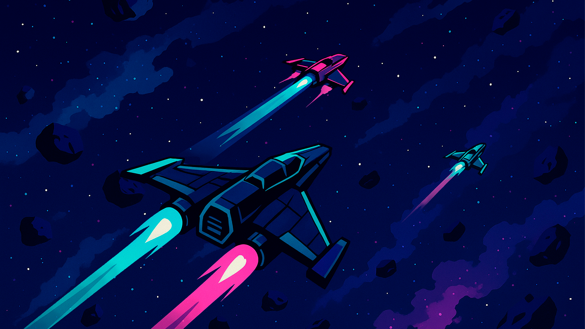
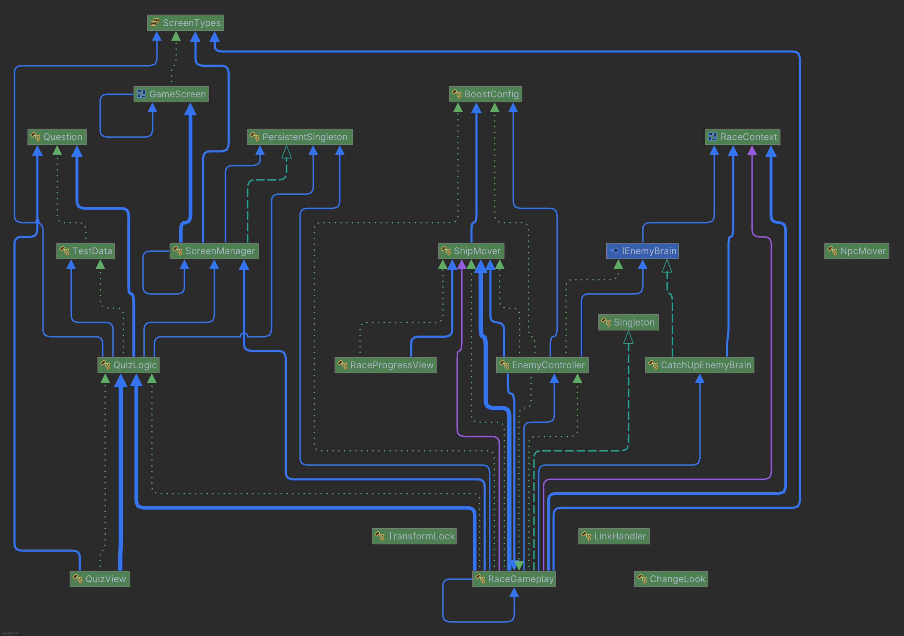

# [Газпром Гонки](https://gr.devnall.ru/)
Казуальная мобильная игра, сочетающая механику гонок и викторины по продуктам банка. Игрок управляет космическим кораблём в гонке, где ускорение зависит от правильных ответов на вопросы о банковских продуктах.

## 1. Общая информация

**Жанр:** казуальная гибрид-игра: Quiz (по продуктам банка) + гонки на космических кораблях.

**Краткая сюжетная обвязка:** Игрок — участник гонки, где победу приносят не только скорость, но и знания о банковских продуктах. По мере прохождения уровней пилот узнаёт о продуктах банка, а за успехи получает купоны и бонусы.

**Правила / механика:**

-   В меню игрок выбирает уровень (одиночный раунд).
-   Заезд длится фиксированное время/дистанцию; в течение заезда показывается ровно 6 вопросов.
-   При появлении вопроса игрок выбирает вариант.

    -   **Правильно** — кратковременное ускорение корабля игрока.

    -   **Неправильно** — ускорение не даётся; показывается объяснение + ссылка на страницу продукта банка.
-   После 6 вопросов включается ускорение до финиша.
-   **Результат**: если игрок финиширует первым — предлагается подарок (купон на подписку). В идеале (не врамках хакатона): выдавать купон только после прохождения нескольких уровней. Или реализовать сохранение прогрессии прохождения по уровням.

## 2. Пользовательский сценарий

1.  **Запуск** — Загрузка контента, переход в меню.

2.  **Выбор уровня** — Выбор уровня. Сейчас все уровни доступны, они абсолютно идентичны, а вопросы выбираются случайно из заготовленной базы в 29 штук. Число уровней на данный момент просто создает желание прогрессировать и опробовать что-то новое, искуственно увеличивая продолжительность сессии.

3.  **Гонка & Quiz** — Игровой экран разделен формально на две половины. Нижняя часть содержит вопрос и 3 варианта ответа. Верхняя часть состоит из прогресса бара заезда. На заднем плане можно наблюдать живой космос, а также корабль игрока и противника.

    -   При ответе корректно: анимация ускорения, и надпись что игрок — Молодец.

    -   При неверном: окно с объяснением содержащее гипер-ссылки на страницы продуктов банка.

6.  **Финиш** — Экран результатов.

    -   Если 1-е место — Сообщение о победе и возможности получить подарок.

    -   Если 2-е —  Сообщение о проигрыше и возможности повторить заезд.

7.  **Купон** — В случае "получения подарка", открываетс ястраница с купоном, где его можно получить.

## 3. Техническое описание

-   **Игровой движок:** Unity 6.2

-   **Целевая платформа сборки:**  WebGL

-   **Веб-контейнер:**

    -   **HTML-файл:**  `index.html` — основная страница-обертка для игры.

    -   **JavaScript:** Файлы `*.js` — обеспечивают взаимодействие между игрой и браузером, загрузку и инициализацию.

    -   **WebAssembly (Wasm):** Код игры компилируется в высокопроизводительный байт-код `*.wasm`, который выполняется браузером.

-   **Дополнительные ресурсы:** Ассеты (модели, текстуры, аудио) упакованы в файлы `*.data`.
-  **Сжатие:** Все ресурсы и скрипты пакованы в Gzip формат, `*.gz`. Размер билда: ~18 Мб.
- **Внутряняя кухня:** Это диаграмма **зависимостей**, так что просто инвертируем стрелки глазками)

## 4. Аппаратные требования
- **Платформы:** мобильные устройства Android и iOS
- **Минимальные требования:**
    - Android 8.0+, 2 ГБ ОЗУ
    - iOS 14+, устройства начиная с iPhone 8
- **Ориентация экрана:** вертикальная (портретная)
- **Браузеры:** поддерживающие WebGL 2, HTML 5, 64 bit, WebAssembly.

Примеры платформ:| Мобильный браузер  | Платформа |
-|--|--|
-| Safari 15 and newer | iOS |
-| Chrome 58 and newer | Andorid|

## 5. Экономическая модель
**Финансовая выгода для банка:**

**Минимальные затраты:** реализация построена на существующих продуктах банка, отсутствуют прямые денежные призы.  

**Рост продаж:** привлечение клиентов к продуктам, усиление лояльности и активности.  

**Эффективность рекламы:** ненавязчивое представление продуктов в игровой форме повышает конверсию.

**Стратегия продвижения:**
- Первоначальное привлечение через Push-уведомления и размещение виджета на главной странице.  
- Формирование привычки возвращения в игру через игровые механизмы и регулярные «подарки»

**Польза для банка:**
- Рост спроса на продукцию банка благодаря ознакомительной природе наград.  
- Повышение узнаваемости и лояльности клиентов.  
- Увеличение среднего времени пребывания в приложении, что положительно сказывается на конверсии.

**Награды и их назначение:**

**Премия за завершение гонки**
Пользователь получает баннер с поздравлением и названием специального подарка, например:
- «Вам доступна программа Газпромбонус!»
- «50% скидки на годовую подписку Газпромбанка Мобайл!»
Назначение: привлечение внимания к существующим продуктам банка и формирование положительного отношения к бренду.

**Награда за правильные ответы**
При правильном ответе пользователь увеличивает скорость корабля и приближается к победе.
Назначение: мотивация к внимательному изучению информации о продуктах банка.

**Ссылки на подробности**
При любом неверном ответе появляется баннер с разъяснением, содержащий ссылку на соответствующую страницу продукта.
Назначение: помощь пользователю в изучении деталей продуктов банка и возможное последующее обращение к ним.

**Регулярные «подарки дня»**
Один из видов наград будет «подарок дня», разыгрываемый ежедневно среди победителей гонок. Это может быть дополнительная скидка или временный бонус.
Назначение: поддерживание постоянного интереса и возвращение игроков в игру.

